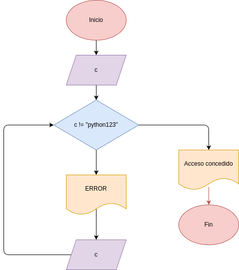
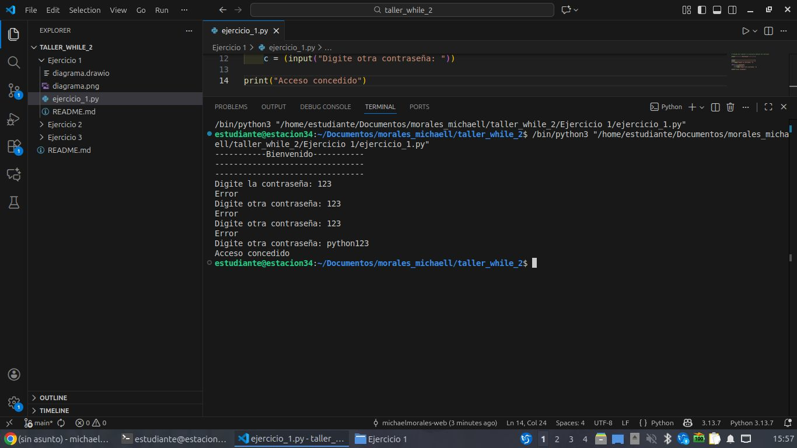

# Ejercicio_1
Programa en Python usando el comando while para determinar si la contraseña para ingresar en una aplicacion es correcta o no

## Análisis

### Variable de entrada
- c = contraseña

### Procesamiento
- while  c != "python123"
    c = Error
    c = Digite otra contraseña

### Variable de salida
- c

## Diseño
- 

## Referencia
- 

## Construcción
- Programa digitado en el archivo ejercicio_1.py