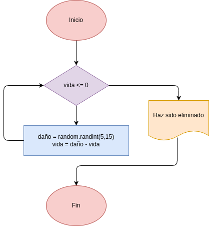
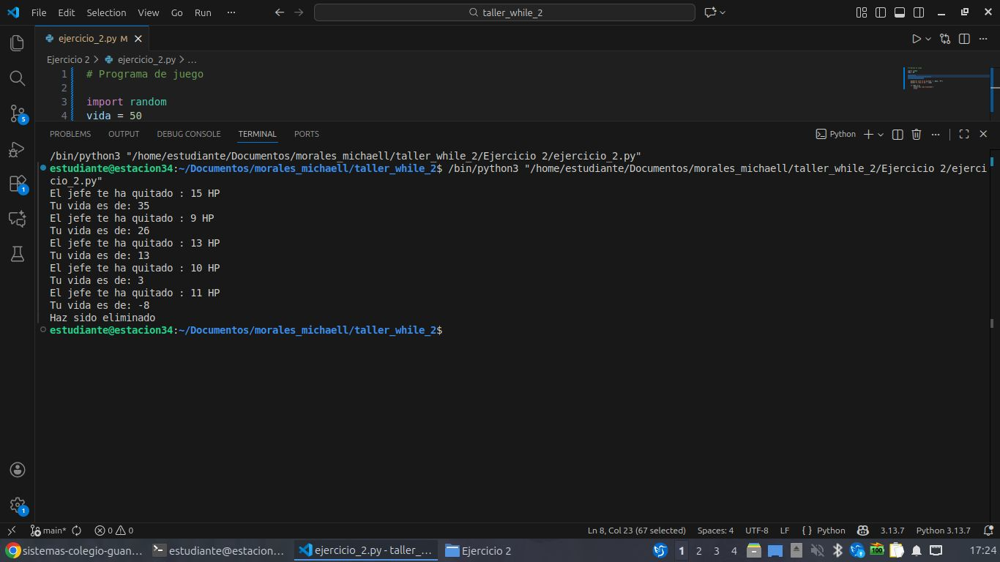

# Programa de juego

## Análisis

### Procesamiento
- while True:
    daño = random.randint(5, 15)
    vida = vida - daño

## Diseño
- 

## Referencia
- 

## Construcción
- Codigo implementado en el archivo ejercicio_2.py