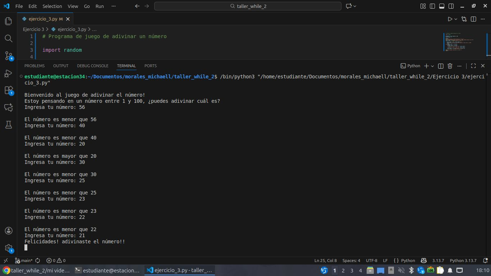

# Programa de juego de adivinar un número

## Análisis

### Variable de entrada
- player_number

### Procesamiento
- if player_number > 100 or player_number < 1:
    print("Número inválido, por favor ingresa un número entre 1 y 100")
    exit()
while player_number != pc_number:
    print()
    if player_number < pc_number:
        print("El número es mayor que", player_number)
    else:
        print("El número es menor que", player_number)
    player_number = int(input("Ingresa tu número: "))

### Variable de salida
- player_number

## Diseño
- 

## Referencia
- 

## Construcción
- codigo implementado en el archivo ejercicio_3.py
