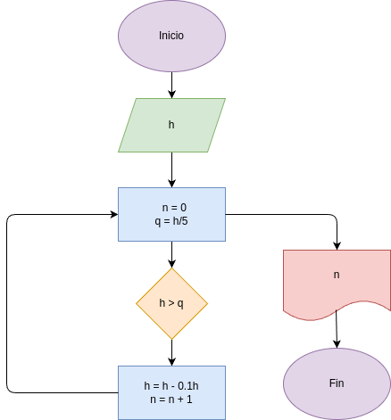

# ejercicio_4
Programa para calcular en que cantidad de rebotes una pelota va a dejar de revotar mas de la quinta parte de su longitud

## Análisis

### Variable de entrada
- h = altura

### Procesamiento
 - n =0
 q = h / 5
 h > q
 h = h - 0.5 h
 n = n + 1

### Variable de salida
- n = número de rebotes en que la pelota deja de rebotar mas de su quinta parte

## Diseño

## Referencia

## Construcción
- Codigo implementado en el archivo ejercicio_4.py