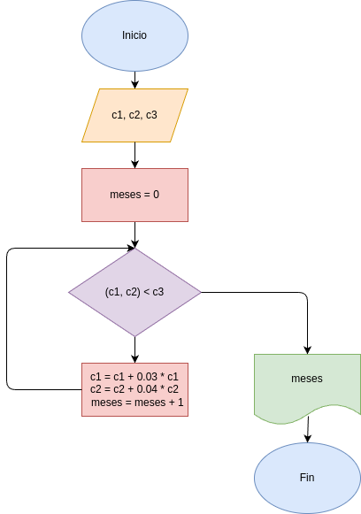

# ejercicio_5

## Análisis

### Variables de entrada
- Capital de Juan
- Capital de Pedro
- Capital necesario para empezar el negocio

### Procesamiento
- (c1 + c2) < c3:
    c1 = c1 + 0.03 * c1
    c2 = c2 + 0.04 * c2
    meses = meses + 1

### Variable de salida
- meses

## Diseño
- 

## Construcción
- codigo implementado en el archivo ejercicio_5.py