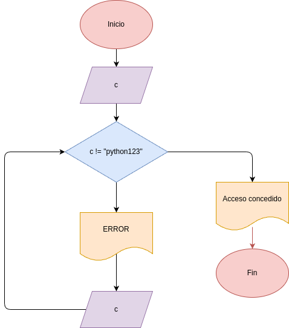
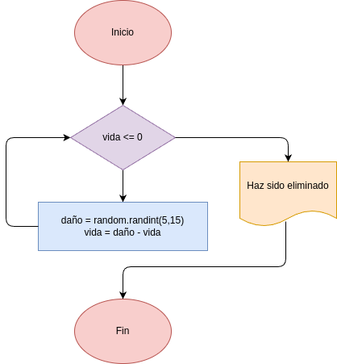
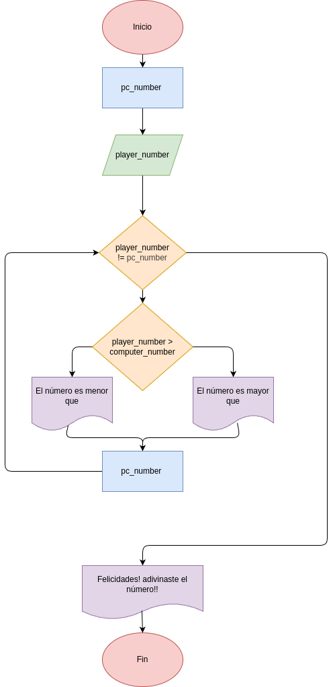
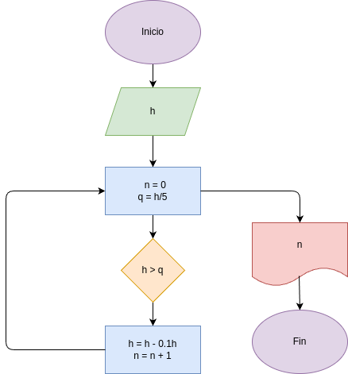
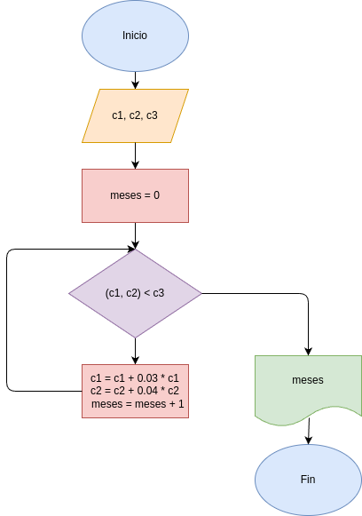

# taller_while_2
Taller para hacer el uso del comando while en Python en tres ejercicios

# ejercicio_1
Programa para ingresar a una aplicación mediante una contraseña

# ejercicio_2
Programa de juego

# ejercicio_3
Programa de juego para adivinar

# ejercicio_4
Programa para calcular en que cantidad de rebotes una pelota va a dejar de revotar mas de la quinta parte de su longitud

# ejercicio_5
Este programa calcula en cuantos meses Pedro y Juan podran reunir el dinero necesario para un negocio. Pedro invierte su dinero  con un interes compuesto del 3% mensual. Juan invierte su dinero con un interes compuesto del 4% mensual

